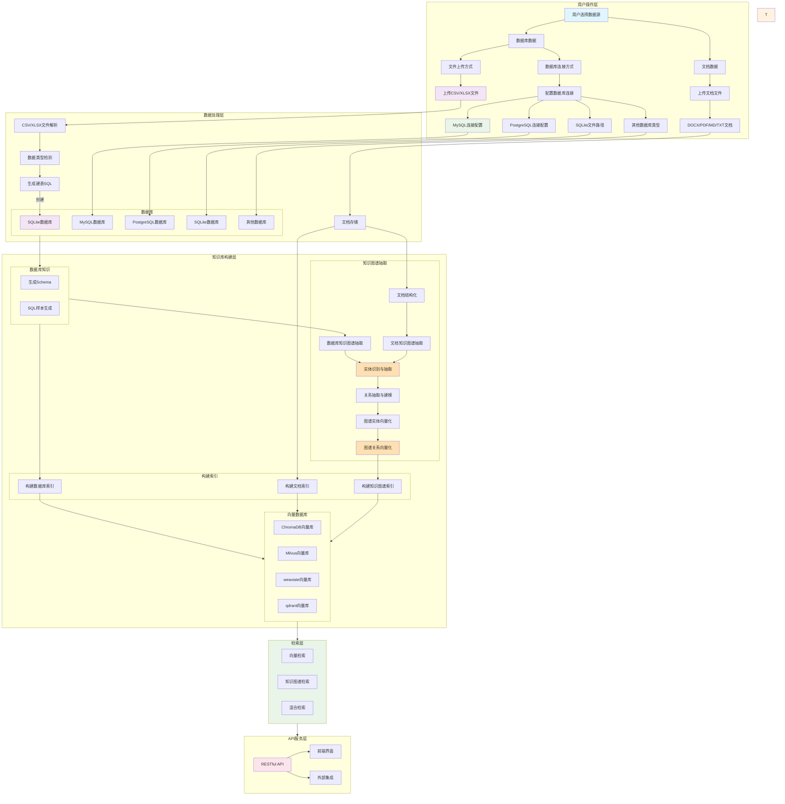

# 知识库构建

知识库初始化是 Chat2Dashboard 系统的核心功能之一，它允许用户通过上传数据文件（CSV/XLSX）和相关文档，自动创建数据库并生成智能分析代理。系统会自动解析数据结构，生成SQL训练样本，并构建向量知识库以支持自然语言查询。

## 功能特性

- 📊 **多数据源支持**: 
  - 文件上传：支持 CSV、XLSX 文件上传
  - 数据库连接：支持 MySQL、PostgreSQL、SQLite 等主流数据库
- 📚 **文档集成**: 支持 DOCX、PDF、Markdown、TXT 文档上传
- 🤖 **智能代理**: 自动训练数据库查询代理
- 🔍 **向量检索**: 基于多种向量数据库的语义搜索
- 🕸️ **知识图谱**: 自动抽取实体关系并构建知识图谱
- 🧠 **图谱向量化**: 实体和关系的向量化存储与检索
- 📋 **模式管理**: 自动生成和维护数据库模式信息
- 🔄 **增量更新**: 支持模式信息的动态更新
- 🔀 **混合检索**: 结合向量检索、知识图谱检索的多模态检索

## 系统架构流程

